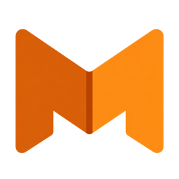
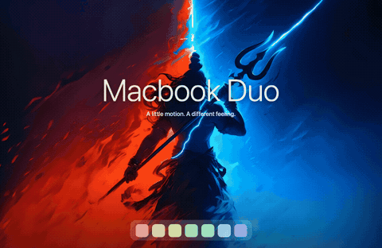
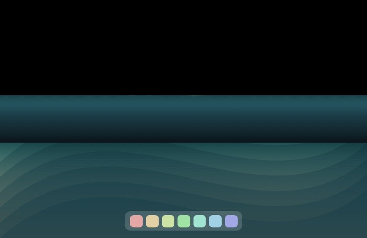
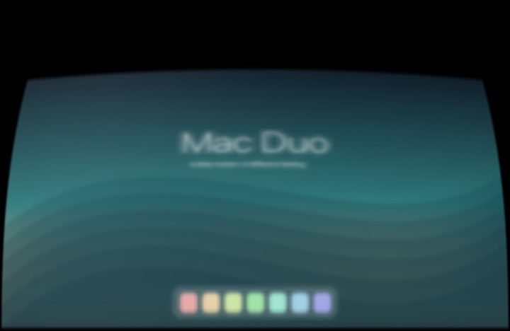
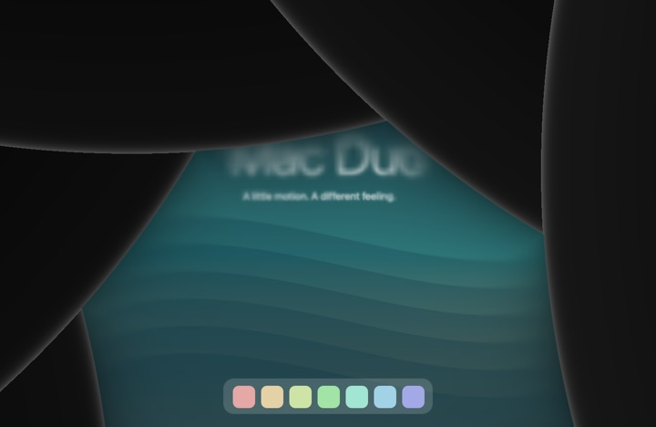

# Macbook Duo

**Make your desktop feel physical.** Six effects that follow the movement of your MacBook lid.

### [↓ Download for Apple silicon](https://github.com/shivamchopra7/Macbook-Duo-App/releases/latest/download/Macbook-Duo.dmg)

[Intel preview download](https://github.com/shivamchopra7/Macbook-Duo-App/releases/latest/download/Macbook-Duo-Intel.dmg) · Intended for the 2019 16-inch MacBook Pro; physical Intel verification is pending.

[Website](https://shivamchopra7.github.io/Macbook-Duo-App/) · [All releases & ZIP](https://github.com/shivamchopra7/Macbook-Duo-App/releases) · [Changelog](CHANGELOG.md) · [Build from source](docs/DEVELOPMENT.md) · [Report an issue](https://github.com/shivamchopra7/Macbook-Duo-App/issues)

 Generated Duo demo. Your real desktop stays on your Mac.

## Six ways to close

| Effect | What it feels like |
|---|---|
| **Duo** · default | The desktop expands, softens and disappears around the hinge. |
| **Ghost** | The desktop appears anchored behind the tilting lid, with gradual defocus. |
| **Roll** | A flexible display curling into a roll. |
| **Shutter** | Four rigid panels sliding behind one another. |
| **Flex** | A continuous display bowing under tension. |
| **Iris** | Precision blades closing around the desktop. |

Hold the lid still and the screen clears after **1–5 seconds**—**2 seconds** by default. Live preview, compact floating controls, orange Light/Dark themes, menu-bar access and an opt-in **Open at login** setting are included. Login launches start paused. The menu-bar icon stays visible by default but can be hidden. Close settings or switch desktops: Macbook Duo keeps following in the background, without raising its window. Press **Esc** or **⌃⌥⌘F** to pause.

## Install

**Macbook Duo 0.1.14 supports macOS 13 Ventura or newer**, with six effects including Ghost. A compatible continuous lid-angle sensor is required. The native Apple-silicon build was tested on an M4 Mac; physical Ventura and Intel testing are still pending.

> [!NOTE]
> **MacBook compatibility · macOS 13+** 
> **Expected to work:** MacBook Air with M2 or newer, and 14-/16-inch MacBook Pro with M1 Pro/Max or newer. 
> **Intel preview:** 2019 16-inch MacBook Pro. This download compiles and packages natively for Intel, but still needs physical hardware verification. 
> **Unsupported:** M1 MacBook Air, 13-inch MacBook Pro with M1 or M2, and Intel models that expose only an open/closed clamshell switch. 
> Tested on an M4 MacBook Pro. Macbook Duo checks for a compatible lid sensor; external displays are not animated.

1. Download [**Macbook-Duo.dmg** for Apple silicon](https://github.com/shivamchopra7/Macbook-Duo-App/releases/latest/download/Macbook-Duo.dmg) or [**Macbook-Duo-Intel.dmg** for Intel](https://github.com/shivamchopra7/Macbook-Duo-App/releases/latest/download/Macbook-Duo-Intel.dmg), open it, and drag **Macbook Duo** into **Applications**.
2. Open **Macbook Duo** from Applications. This release is **not notarized**, so macOS may initially block it with “cannot be opened” or “Apple could not verify” wording.
3. After trying to open it, go to **System Settings → Privacy & Security**, scroll to **Security**, click **Open Anyway** for **Macbook Duo**, then confirm **Open**. [Apple’s instructions](https://support.apple.com/102445).
4. In Macbook Duo, click **Enable Macbook Duo** and allow **Screen Recording** when prompted. Reopen the app if macOS asks. Desktop frames stay in memory; nothing is recorded or uploaded.

Try **Replay** first—it works without Screen Recording permission. For manual control, turn off **Follow my lid**. Keep **Clear when the lid is still** enabled for normal use at any angle.

<strong>Updating or using the ZIP instead</strong>

In Macbook Duo, choose **Check for Updates…** from the header or menu bar, then **Install & Relaunch**. The app checks the official GitHub release, selects the native Apple-silicon or Intel ZIP, and verifies the download before replacing itself. Checks run only when you ask. macOS may require **Privacy & Security → Open Anyway** for an update; the recovery dialog lets you retry or restore the previous app. Install the app in a writable Applications folder first.

For a manual update, quit Macbook Duo before replacing the app in Applications. For the ZIP, unzip it and move **Macbook Duo.app** into Applications, then follow steps 2–4 above. Development signatures may require granting Screen Recording again after an update. If permission appears enabled but capture fails, remove the old Macbook Duo entry in Screen Recording settings, add the current app from Applications, and reopen it.

## Languages

Macbook Duo supports English, Simplified Chinese, Traditional Chinese and Japanese. It follows your macOS language preferences, with English as the fallback. To choose a language just for Macbook Duo, add it under **System Settings → General → Language & Region → Applications**, then quit and reopen the app.

## Small, local, open

Native **Swift + Metal**, with no third-party runtime dependencies, accounts or analytics. Effects stay entirely local; **Check for Updates** contacts GitHub only when you request it, and installation downloads the release. No screen content is sent. Settled previews stop rendering; blur is cached. Rendering is capped according to power and temperature, with up to 120 Hz requested on supported displays while plugged in. Actual frame rate and battery impact vary by Mac.

[Build & verification](docs/DEVELOPMENT.md) · [Reference credits](ATTRIBUTION.md) · [MIT license](LICENSE)

Independent software, not affiliated with Apple. Contributions and hardware reports are welcome.
