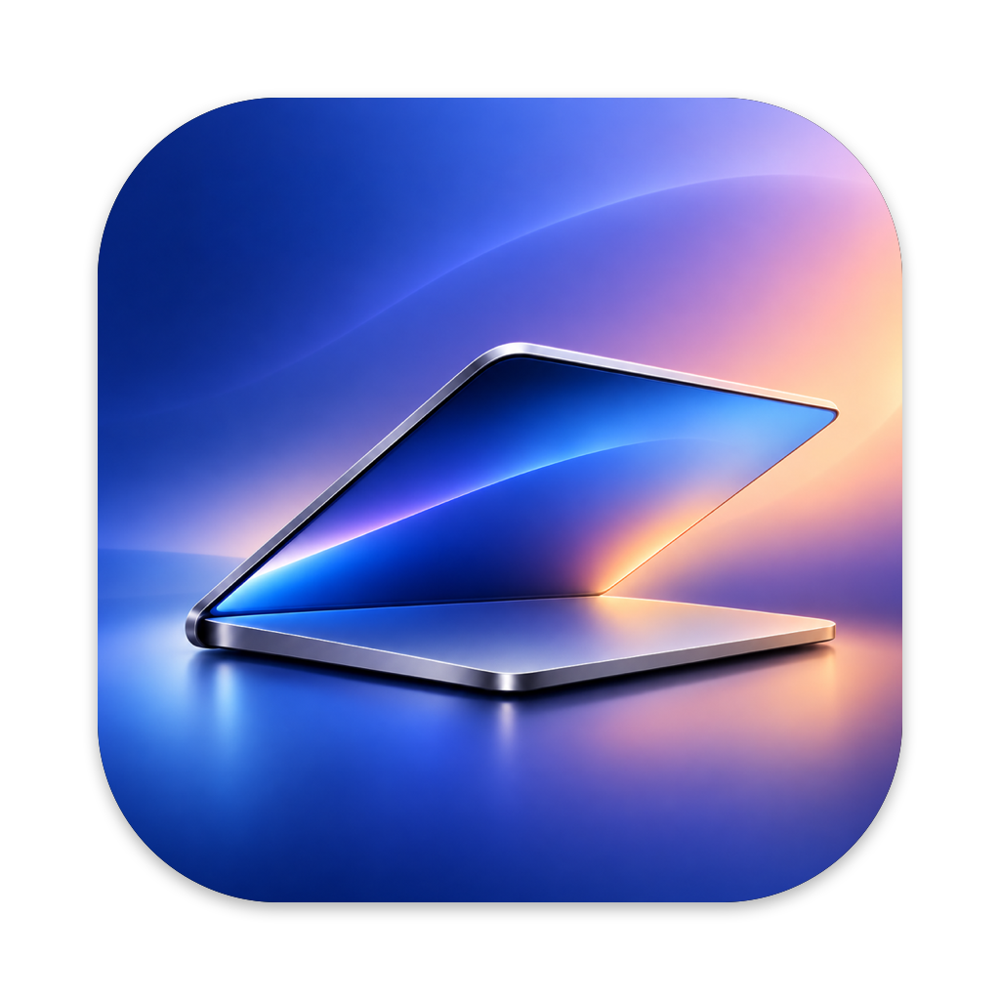
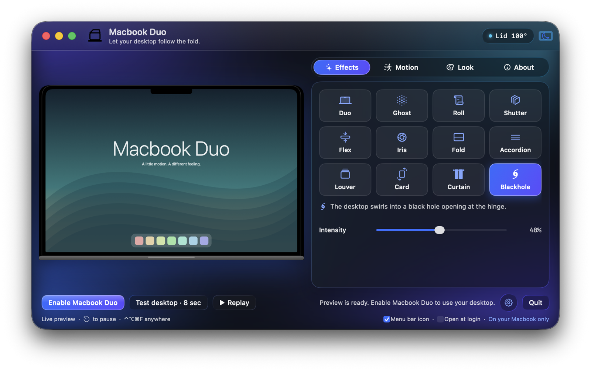
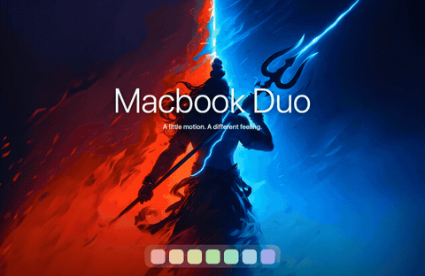
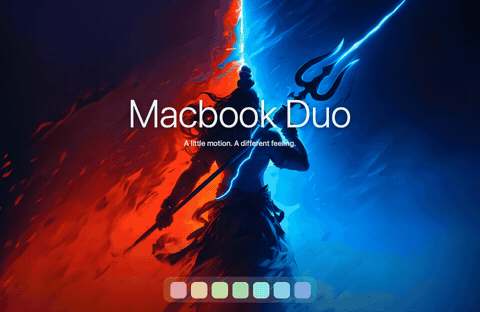
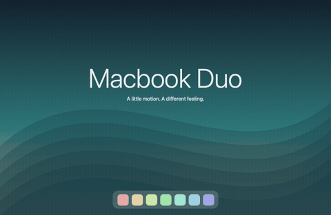
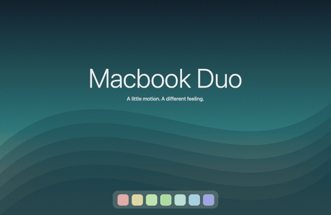
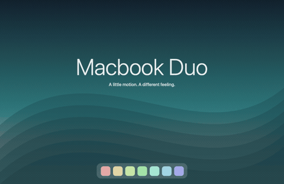
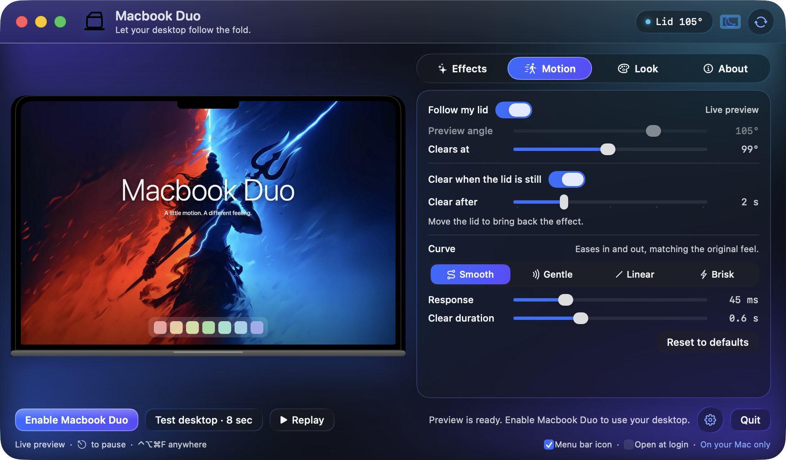

# Macbook Duo

**Your desktop follows your lid.** A native Swift + Metal menu-bar app that animates the desktop as you close your MacBook, with twelve effects to choose from.

[](https://github.com/shivamchopra7/Macbook-Duo-App/releases/latest)
[](#compatibility)
[](LICENSE)

## Download

| Build | Link |
|---|---|
| Apple silicon (recommended) | [**Macbook-Duo.dmg**](https://github.com/shivamchopra7/Macbook-Duo-App/releases/latest/download/Macbook-Duo.dmg) |
| Intel preview | [**Macbook-Duo-Intel.dmg**](https://github.com/shivamchopra7/Macbook-Duo-App/releases/latest/download/Macbook-Duo-Intel.dmg) |
| Everything else (ZIPs, checksums, older versions) | [All releases](https://github.com/shivamchopra7/Macbook-Duo-App/releases) |

Version 1.0.0 · [Website](https://shivamchopra7.github.io/Macbook-Duo-App/) · [Changelog](CHANGELOG.md) · [Build from source](#build-from-source) · [Report an issue](https://github.com/shivamchopra7/Macbook-Duo-App/issues)

<p align="center"></p>

## What it does

Macbook Duo reads the lid-angle sensor built into recent MacBooks, captures the desktop with ScreenCaptureKit and renders a Metal effect on a full-screen overlay. As the lid tilts, the desktop bends, folds, rolls or drains away in real time; open it again and everything returns to pixel-exact focus. Hold the lid still at any angle and the screen clears after a short pause.

- Twelve effects, each with its own feel and its own tuning.
- A settings window in a Liquid Glass design language with four sections: **Effects**, **Motion**, **Look** and **About**, plus a live MacBook-shaped preview.
- Light, dark or system appearance.
- Menu-bar access, an opt-in **Open at login** setting (launches start paused), and a menu-bar icon that can be hidden.
- Press **Esc** or **⌃⌥⌘F** anywhere to pause.
- Native Swift + Metal with no third-party runtime dependencies, accounts or analytics.

## Twelve effects

Duo is the default. The six effects marked **New** were added in 1.0.0.

| Effect | What it feels like |
|---|---|
| **Duo** · default | The desktop swells around the hinge as the lid closes. |
| **Ghost** | The desktop holds its resting plane as the lid tilts and gently falls out of focus. |
| **Roll** | The desktop curls into a roll that travels down to the hinge. |
| **Shutter** | Rigid panels telescope behind each other into the hinge. |
| **Flex** | One bowing flexible display collapses toward the hinge. |
| **Iris** | Eight overlapping blades close an aperture above the hinge. |
| **Fold** · New | The display creases across the middle and the top half folds down over the bottom. |
| **Accordion** · New | Pleats zig-zag and gather toward the hinge like a paper fan. |
| **Louver** · New | Horizontal slats tilt and overlap like closing window blinds. |
| **Card** · New | The whole desktop tips back as one rigid card in perspective. |
| **Curtain** · New | Drapes draw together from both sides and settle at the hinge. |
| **Ripple** · New | Liquid rings spread from the hinge and the desktop drains into it. |

Shutter, Accordion, Louver and Curtain divide the display into a configurable number of segments.

| Duo | Ghost | Roll | Shutter |
|---|---|---|---|
|  |  |  |  |

| Flex | Iris | Fold | Accordion |
|---|---|---|---|
|  |  |  |  |

| Louver | Card | Curtain | Ripple |
|---|---|---|---|
|  |  |  |  |

Previews are generated artwork. Your real desktop never leaves your Mac.

## Options

Every control lives in the settings window. **Reset to defaults** restores the original tuning in one click.

<p align="center"></p>

| Control | Range | Default | Notes |
|---|---|---|---|
| Effect | Duo, Ghost, Roll, Shutter, Flex, Iris, Fold, Accordion, Louver, Card, Curtain, Ripple | Duo | Persisted across launches. |
| Intensity | 0–100% | 50% | Exaggerates each effect's geometry. 50% reproduces the original tuning. |
| Segments | 2–8 | 4 | Panel, pleat, slat or drape count for Shutter, Accordion, Louver and Curtain. |
| Curve | Smooth, Gentle, Linear, Brisk | Smooth | How fold progress advances between open and closed. Smooth eases in and out; Gentle starts slowly; Linear tracks the lid one-to-one; Brisk responds immediately, then settles. |
| Response | 20–120 ms | 45 ms | Time constant of the motion smoothing while the lid moves. |
| Clear duration | 0.3–1.2 s | 0.6 s | Length of the animation back to a clear desktop. |
| Perspective | 0–100% | 70% | Depth of the hinge-anchored projection. |
| Softness | 0–100% | 65% | Progressive defocus as the lid closes. |
| Shadow | 0–100% | 65% | Contact and hinge shadows. |
| Clears at | 60°–140° | 105° | The lid angle at which the effect is fully clear. |
| Clear when the lid is still | On / Off | On | Clears the effect after the lid rests. |
| Clear after | 1–5 s | 2 s | How long the lid must rest before clearing. Move the lid to bring the effect back. |
| Follow my lid | On / Off | On | Turn off for manual control of the preview. |
| Preview angle | 5°–140° | 72° | Drives the preview when Follow my lid is off. |
| Appearance | Light, Dark, System | System | Applies to the settings window. |

## Install

1. Download [**Macbook-Duo.dmg**](https://github.com/shivamchopra7/Macbook-Duo-App/releases/latest/download/Macbook-Duo.dmg) for Apple silicon (or [**Macbook-Duo-Intel.dmg**](https://github.com/shivamchopra7/Macbook-Duo-App/releases/latest/download/Macbook-Duo-Intel.dmg) for Intel), open it and drag **Macbook Duo** into **Applications**.
2. Open **Macbook Duo** from Applications. The app is ad-hoc signed and **not notarized**, so macOS may first show "cannot be opened" or "Apple could not verify".
3. Go to **System Settings → Privacy & Security**, scroll to **Security**, click **Open Anyway** next to Macbook Duo, then confirm **Open**. See [Apple's instructions](https://support.apple.com/102445).
4. Press **Replay** to watch the effect on the built-in preview. Replay works without any permission.
5. Click **Enable Macbook Duo** and allow **Screen Recording** when prompted. Reopen the app if macOS asks. Desktop frames stay in memory; nothing is recorded or uploaded.

For manual control, turn off **Follow my lid** and drag **Preview angle**. Keep **Clear when the lid is still** on for everyday use at any angle. Prefer a ZIP? Unzip it, move **Macbook Duo.app** into Applications and follow steps 2–5.

## Updating

Choose **Check for Updates…** from the settings window or the menu bar, then **Install & Relaunch**. Macbook Duo reads the latest stable release from the official GitHub repository, picks the native Apple-silicon or Intel ZIP, verifies its SHA-256 checksum and bundle before replacing itself, and preserves your preferences. Checks run only when you ask; there is no background polling.

macOS may require **Privacy & Security → Open Anyway** for the updated app, and Screen Recording may need to be approved again because ad-hoc signatures change with each build. The recovery dialog lets you retry or restore the previous app. Install into a writable Applications folder. For a manual update, quit Macbook Duo before replacing the app. If Screen Recording appears enabled but capture fails, remove the old Macbook Duo entry from Screen Recording settings, add the current app from Applications and reopen it.

## Compatibility

Macbook Duo requires **macOS 13 Ventura or newer** and a MacBook with a **continuous lid-angle sensor**. It checks for the sensor at launch; external displays are not animated.

| Status | Models |
|---|---|
| Supported | MacBook Air with M2 or newer; 14-inch and 16-inch MacBook Pro with M1 Pro/Max or newer |
| Intel preview | 2019 16-inch MacBook Pro. A native x86_64 build is provided, but physical Intel verification is still pending. |
| Unsupported | M1 MacBook Air; 13-inch MacBook Pro with M1 or M2; Intel models that expose only an open/closed clamshell switch |

The Apple-silicon build is native ARM64 and needs no Rosetta. Animation cannot be guaranteed while the display is asleep, during login or over protected content.

## Languages

English, Simplified Chinese, Traditional Chinese and Japanese. Macbook Duo follows your macOS language preferences, with English as the fallback. To choose a language just for Macbook Duo, add it under **System Settings → General → Language & Region → Applications**, then quit and reopen the app.

## Privacy

- Desktop frames stay in bounded memory on your Mac. They are never saved, uploaded or analyzed.
- ScreenCaptureKit excludes Macbook Duo's own windows from capture, and audio capture is disabled.
- No accounts, no analytics, no telemetry and no third-party runtime dependencies.
- The only network activity is a user-initiated update check against the official GitHub release, over HTTPS.
- Public builds are ad-hoc signed and not notarized. SHA-256 checksums detect corrupt downloads; trust rests on the official repository and GitHub HTTPS.
- Settled previews stop rendering, blur work is cached, and refresh is capped according to power and temperature, with up to 120 Hz requested on supported displays while plugged in.

## Build from source

Requires Xcode 16 or newer (Swift 6) on macOS.

```sh
git clone https://github.com/shivamchopra7/Macbook-Duo-App.git
cd Macbook-Duo-App
./build.sh
open "build/Macbook Duo.app"
```

Run the unit tests and the offscreen GPU render check (generated artwork only; no desktop capture):

```sh
swift test
swift build
.build/debug/MacbookDuo --render-check validation
```

Add `--effects duo,fold` to check a subset, `--animation` to export closing and reopening frames for each effect, `--no-timing` to record GPU times without gating, or `--strict-timing` to enforce the budget on p95 as well. See [docs/DEVELOPMENT.md](docs/DEVELOPMENT.md) for signing, the Intel build, packaging, releases and adding a new effect.

## Contributing

Issues, hardware reports and focused pull requests are welcome. Please read [CONTRIBUTING.md](CONTRIBUTING.md) first: run `swift test` and the render check, never attach desktop recordings or signing credentials, keep the app dependency-free, and respect Reduce Motion.

## License & credits

Macbook Duo is released under the [MIT License](LICENSE). Third-party notices, the sensor research it relies on and the effect studies that shaped it are listed in [ATTRIBUTION.md](ATTRIBUTION.md).

Made by Shivam Chopra. Independent software, not affiliated with Apple.
